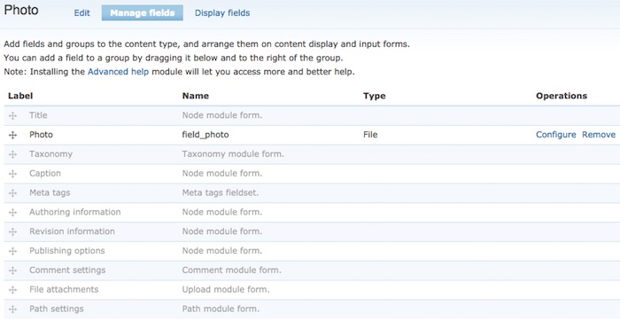
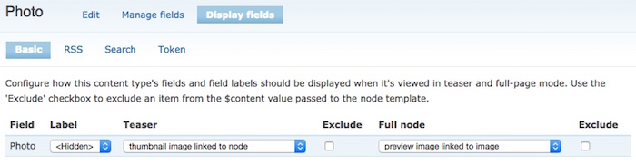

# Migrate Drupal Photo content type (from Drupal 6 to 8)


## Update (May 8, 2016)

The main script in this project — _MigrateAllD6Photos.php_ — now seems to be working. The code is ugly and doesn't check for SQL errors, but for my purposes it seems to be working okay. To get that script to work and migrate your Drupal 6 photo content type to a Drupal 8 photo content type, you also need to run a couple of queries shown here.


## The problem this project solves

A long time ago on my Drupal 6 (D6) websites I created a simple _Photo_ content type (per the "Using Drupal" book, if I remember right). Using that content type, I added over 1,700 images to just one of my websites, so it’s really important that I migrate those images to my new Drupal 8 (D8) website.

Unfortunately the Drupal 8.1.0 migration process doesn’t handle these images. They just don’t work after the migration process. You can read more about this at [this drupal.org link](https://www.drupal.org/node/2167633), which states:

>"Images attached to Drupal 6 Image nodes, and files attached with File fields do not get migrated."

This is a *HUGE* show-stopper of a problem for me, so I’ve been working to create a solution for this. I just got a solution working that works for me, so I thought I’d share that here for anyone else who’s feeling this pain. (It has taken me three days to figure this out.)


## One important caveat

An important caveat of my solution is that if you created your Drupal 6 (D6) photo content type using ImageCache and ImageField modules, and created smaller “preview” images when you uploaded your original images, those smaller “preview” images are long gone. That has nothing to do with me. They're just not migrated over by Drupal 8.1.0. The only image files that are migrated over are the large, original images you uploaded.

I can live with that limitation, as I’m about to work on another small project to make sure that all of these images are either less than 730 pixels wide (to match my new website’s format). If the images are larger than that, I’ll re-size them and then update the database tables with the new height/width information.

If you can live with that limitation — that I make no attempt to use the old “preview” images — this project may work for you.


## Very important assumptions this script makes

My script makes at least the following assumptions. If these don’t match your configuration, you’ll have to adapt the script to make it work for your website.

1) I assume that on your D6 website you have a Content Type with the exact name “Photo”. I assume that you can edit that content type at the 'admin/content/node-type/photo' URI on your D6 website.

2) If you click “Manage fields” at that URI, the form that is shown will show one active row in the table with these values: Label="Photo", Name="field_photo", and Type="File". This is what these settings look like on my D6 website:



Those are really important. If you don’t have those exact settings, my script won’t work. (But you’re welcome to modify my script to match your settings.)

This next assumption may not matter, but when I go to the 'admin/content/node-type/photo/display' URI on my D6 website, I see the following settings:



I don’t think that matters, as we’ll be creating a new “photo content type” on the D8 site, but I thought I would mention it.

The only other assumptions I make are:

* You’re willing to create a new photo content type on your D8 website
* You’re willing to live with the caveat/limitation described above
* You’re comfortable running a few SQL queries, and running my PHP script
* You’re working on a dev or test version of your website (not on the production site itself)

(If you try to do any of this on a production website, you are officially crazier than I am.)


## A note about the “Full HTML” format

I used the “Full HTML” format everywhere on my D6 website, and it’s important to me that this was migrated over to my D8 website. At the moment it’s not properly migrated by Drupal 8.1.0, but I show how to fix this problem in my [Migrating a Drupal 6 website to Drupal 8](/drupal/how-to-upgrade-drupal-6-website-to-drupal-8) article, which I also link to below.

If you are not using the “Full HTML” format, you can skip the queries below where I use it. I kept those queries out of my “photo migration” script so as not to intermingle the two issues.


## My solution

### First, the migration

My solution goes like this. First, start with a D6 to D8 migration:

* Perform a "Standard" Drupal 6 (D6) to Drupal 8 (D8) migration. I write about that process at [Migrating a Drupal 6 website to Drupal 8](/drupal/how-to-upgrade-drupal-6-website-to-drupal-8).
* After the migration, confirm that `node__field_photo` and `node_revision__field_photo` database tables are in the D8 database, and the data is populated. If you don't have those tables in your D8 database after the migration, my script won't help.
* Confirm that the original image files are on disk. The file locations may be different, but they should match what's in the D8 database. My files are now under this directory:

````
sites/default/files/photos/...
````

>Again, note that the old "ImageCache" preview files are gone, and when I say "gone," I mean "long gone." My solution only works with the large, original files. I display those files with the PhotoD8 content type I'm about to create.

### Fix the `full_html` format

I noted this in my [Migrating a Drupal 6 website to Drupal 8](/drupal/how-to-upgrade-drupal-6-website-to-drupal-8) article, but if you used the Drupal 6 "Full HTML" format, you also need to run this query:

    UPDATE `node__body` SET `body_format`='full_html' WHERE `body_format`='full_html1';

and then clear the caches:

    drush cr

If you already did that, great.


### Make a backup

Once you finish the initial D6->D8 migration, this is a good time to back up your D8 database and website files. For my website it takes close to 30 minutes to run the migration, so when you need to do that over and over again, you'll find that it's much faster to have these backups.


### Create a new “PhotoD8” content type

Now you need to create a new “PhotoD8” content type. You need this so you can migrated the data from the old "Photo" database tables to the new "PhotoD8" tables using SQL queries.

To do this, go to the 'admin/structure/types/add' URI on your D8 site, and use (exact) these settings:

* Name = "PhotoD8"
* Description can be whatever you want it to be
* Leave everything at its default values, click "Save and Manage Fields"

>You need to use the “PhotoD8” name exactly as shown. This affects things in the database, and if you don’t use that name, my script won’t work.

On the "Manage fields" screen that follows, click "Add field". On the "Add field" form that follows, use these settings:

* "Add a new field": Select "Image" (under Reference)
* Label = "Photo D8"
* Click "Save and continue"

On the next form:

* "Upload destination" = "Public files"
* No "Default Image"
* "Allow number of values" = (Limited, 1)
* Click "Save field settings"

On the next form:

* Label = "Photo D8"
* Make the image field Required
* Enable Alt field.
* Don't make the Alt field required (un-check it)
* Go with other defaults
* Click "Save settings"

You should now be back to "Manage fields." On this screen you should see these two rows in the table:

* Label = "Body", Machine Name = "body", Field Type = "Text (formatted, long, with summary)"
* Label = "Photo D8", Machine Name = "field_photo_d8", Field Type = "Image"

Now you’re ready for the next step.

### Make another database backup

Note: This is another great time to backup the database. You’ll thank me later.


## My PHP Script to migrate the photos

Before running my script, you should verify that the `langcode` field in the `node__field_photo` D8 database table is properly set to 'en' (or whatever your locale is). If it is set to `und`, you _MUST RUN THIS NEXT QUERY_, or you'll just make the problem worse:

    update node__field_photo set langcode='en'

I thought about adding that query to my script, but if you’re using a different language, this won’t make your day any better.

As of May 8, 2016, my [MigrateAllD6Photos.php](MigrateAllD6Photos.php) file is now working. I just tested it against a fresh D8 installation. What it does is:

* Read your D6 photo information, which the migration process copied into your D8 database.
* Copies and transforms that data into the new PhotoD8 tables we just created.

After you run that script, run this command to flush all caches:

    drush cr

After this, your old Photo URLs should work, and should have the "Photo D8" content type.


## What you should see

After you run my script and flush your caches, you should see your old images show up at their old URLs/URIs. For instance, I previously had a “preview” image that showed up at the URI “node/7493”, and now the full-size original image shows up at that URI.

If you don’t see your images showing up at your old URLs, I am sorry, your configuration must be different than mine.


## About me

My name is Alvin Alexander, and you can find me at [alvinalexander.com](http://alvinalexander).


## That’s it, that’s all

This README file goes on for a little while longer, but it’s all just personal notes for me so I can remember how to solve/debug this problem. You’re welcome to read them, but they are very cryptic, so good luck with that. :)


## History: MySQL Database Diffs

The following text isn't important to anyone but me, but I want to keep it here. This is the approach I used to finally find the last queries that were necessary to get this code working.

What I did was:

* Make a backup of the MySQL D8 database
* Add a new photo using the D8 "PhotoD8" content type
* Make another backup of the D8 database
* Do a `diff` on those two backup files, weeding out the junk to find the problem(s)

The following text shows the result of that effort. (If you can understand my cryptic notes, good luck. ;)

````
Database Diffs (The manually-added "Dick Tidrow" PhotoD8 image vs the old/original D6 "Cat" photo)
--------------------------------------------------------------------------------------------------

< INSERT INTO `file_managed` VALUES (2221,'6e6fc9c2-b83b-4f10-b019-39e0ac7c2586','en',1,'dick-tidrow-cubbies.jpg','public://2016-05/dick-tidrow-cubbies.jpg','image/jpeg',30718,1,1462647881,1462647912);
    - newest FIDs are 2221, 2222, 2223
    - Dick Tidrow is 2221, nid=7550
    - Cat Cartoon is 2218 (manual effort, old image)
        - changed uid to 1 (NOTNEEDED)
        - nid=7545, vid=7735
            - title shows up at node/7545, nothing else shows up
        - filesize is correct
    - Chipotle FID is 2219
        - nid=7548, vid=7738
    - the uid for chipotle image is 3, not 1
        - changed to 1 (NOTNEEDED)
    - no content at all at Chipotle url (node/7548)

< INSERT INTO `file_usage` VALUES (2221,'file','node','7550',1);
    - Dick Tidrow at 2221/7550 looks good (added thru ui)
    - Cat at 2218/7545 looks like Dick Tidrow

< INSERT INTO `history` VALUES (1,7550,1462647914);
    - Cat and Dick Tidrow look the same

< INSERT INTO `key_value` VALUES ('state','system.cron_last','i:1462647842;');
> INSERT INTO `key_value` VALUES ('state','system.cron_last','i:1462580283;');
    - hopefully these key/value pairs aren't important

< INSERT INTO `node` VALUES (7550,7740,'photod8','c37a1d9e-a610-4052-b9e0-515764479e13','en');
    - 7550/7740 and 7545/7735 are both here
    - uuid field here
    - all fields look ok

< INSERT INTO `node__body` VALUES ('photod8',0,7550,7740,'en',0,'Dick Tidrow of the Chicago Cubbies.','','anonymous_format');
    - 7550 Dick Tidrow has no body_summary, body_format=anonymous_format
    - 7545 Cat has a body_summary, and body_format=full_html
        - deleted body_summary, changed body_format=anonymous_format  (TODO:MAYBE)
            - want to see if full_html is a problem, so get rid of it

< INSERT INTO `node__field_photo_d8` VALUES ('photod8',0,7550,7740,'en',0,2221,'Dick Tidrow','',576,250);
    - Cat looks like Dick Tidrow
    - confirmed Cat width and height

< INSERT INTO `node_field_data` VALUES (7550,7740,'photod8','en','Dick Tidrow',1,1,1462647847,1462647912,1,0,1,1);
    - title is repeated here
        - i use “” and ‘’ in title (was not a problem)
    - uid was 3, changing it to 1 to match Dick Tidrow (NOTNEEDED)
    - all else is the same

< INSERT INTO `node_field_revision` VALUES (7550,7740,'en','Dick Tidrow',1,1,1462647847,1462647912,1,0,1,1);
    - title is repeated here
        - i use “” and ‘’ in title
    - Cat langcode was 'und', changing to en (TODO:MAYBE)
    - uid was 3, changing it to 1 to match Dick Tidrow (NOTNEEDED)
    - all else is the same
    - --------------------
    - ***** WORKING *****
    - --------------------
        - run `drush cr` and the Cat is now showing up

< INSERT INTO `node_revision` VALUES (7550,7740,'en',1462647881,1,NULL);
    - Cat langcode is 'und', Dick Tidrow is 'en' (TODO:MAYBE)
        - change Cat to match
    - Cat revision_uid=3, Dick Tidrow is 1 (NOTNEEDED)
        - change Cat to match


< INSERT INTO `node_revision__body` VALUES ('photod8',0,7550,7740,'en',0,'Dick Tidrow of the Chicago Cubbies.','','anonymous_format');
    - Cat body_format is full_html, change it to anonymous_format
    - Cat has body_summary, delete it (change)


< INSERT INTO `node_revision__field_photo_d8` VALUES ('photod8',0,7550,7740,'en',0,2221,'Dick Tidrow','',576,250);
    - all is well here
````

And from my followup notes:

````
WHAT PROBLEMS/QUERIES I UNCOVERED
---------------------------------
    - node__body
        - changed body_format=anonymous_format
            - changed back to full_html, ran drush, image still shows
        - deleted body_summary
            - put a summary back in here, it still works
    - node_field_revision (PROBLEM)
        - Cat langcode was 'und', changing to en
            - CONFIRMED: this was the problem
        - ***** WORKING *****
    - node_revision
        - Cat langcode is 'und', Dick Tidrow is 'en'
````

FWIW, the Dick Tidrow images are here:

````
sites/default/files/2016-05/dick-tidrow-cubbies.jpg
sites/default/files/styles/thumbnail/public/2016-05/dick-tidrow-cubbies.jpg
````


